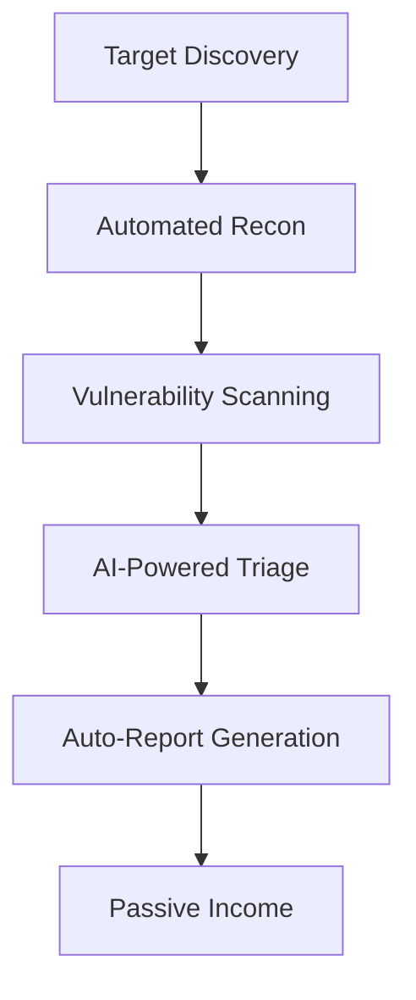

# 🚀 From $0 to $1k/Month: The Bug Bounty Automation Blueprint

**Author**: [REDACTED] (Infosec Writeups)  
**Category**: Automation / Passive Income  
**Published**: [Infosec Writeups](https://infosecwriteups.com/from-zero-to-1000-month-bug-bounty-automation-blueprint-c408bce3e943)  

## 💰 The Profit Pipeline
How a systematic automation approach generated **consistent $1k/month** from bug bounties starting with zero experience.

## 🛠️ Architecture Breakdown

## 🔥 Key Automation Stack
- Low-Code Tools: Burp Suite + Python scripts  
- Cloud Scaling: $5/month DigitalOcean setup  
- Time Management: 2 hours/day maintenance

📈 Income Milestones
| Month	| Earnings	| Bugs Found | 
| 1	| $0	| Learning | 
| 3	| $327	| 8 valid | 
| 6 | 	$1,024 | 	23 |  critical | 

## 📜 Full Blueprint
https://img.shields.io/badge/Read_The_Blueprint-red

🌟 Success Tip: "Automation turns occasional findings into recurring revenue" - Full-Time Hunter
